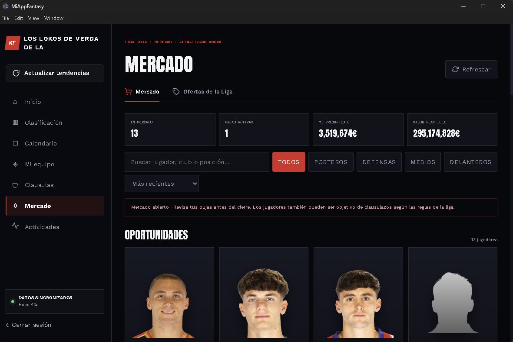

# Mi App Fantasy

A desktop and web companion for **LaLiga Fantasy** leagues, blended with market statistics from **futbolfantasy.com**. It puts everything a manager needs into one fast dashboard: standings with **estimated rival budgets**, the transfer market, buyout clauses, squad management, matchday points and the full league activity feed.

Built with **Angular 22 (standalone components + signals)**, TypeScript and RxJS, and packaged as a **Windows desktop app with Electron**.

> The interface is currently in **Spanish**. English (and more languages) via Angular i18n is on the roadmap.

## Why I built it

LaLiga Fantasy has no proper PC experience: there is no desktop app and the web version is limited. I wanted to manage my league comfortably from my computer and **automate the repetitive tasks** (like listing or withdrawing a whole squad from the market), so I built my own client on top of the official app's API and enriched it with data the original doesn't show, such as **how much each player's value has moved in the last 24 hours**, without leaving the app.

> **Disclaimer:** this is an independent, educational side project. It is not affiliated with, endorsed by or sponsored by LaLiga or any third-party site it consumes data from.



---

## Features

| Section | What it does |
| --- | --- |
| **Home** | Lists your leagues and lets you pick the active one. |
| **Standings** | League table plus an **estimated budget for every manager**, reconstructed from the league's activity history (transfers, market signings, sales to the league, matchday bonuses, raised clauses) and player market-value history. Your own team shows the exact figure. |
| **Fixtures** | Matchday-by-matchday calendar with results, per-match player stats and MVP. |
| **My Squad** | Filter and sort your players, track 24h market-value changes, **bulk list / withdraw players on the market** in a couple of clicks, raise release clauses and manage direct offers. |
| **Squad Points** | Week-by-week lineup and points per player, with totals and averages. |
| **Buyout Clauses** | Every manager's players in one place: filter by manager, position and availability, live countdown for locked clauses, profitability sorting and one-click buyout with confirmation. |
| **Market** | Browse the league market, search/filter/sort, and place, modify or cancel bids. |
| **Offers** | Incoming offers for your players, with accept / reject flows. |
| **Activity feed** | Full league history with filters (manager, type, time range), search and incremental loading. |
| **Player stats modal** | Per-player breakdown by matchday, reused across sections. |
| **Market trends** | Price trends (1d to 30d) parsed from a public trends page and **matched to league players with a weighted fuzzy name-matching algorithm** (accent normalisation, tokens, initials, slug, market-value proximity, position). |

## Tech highlights

- **Angular 22** with standalone components, **signals**, `computed()` and `toSignal` / `toObservable` interop.
- **Lazy-loaded routes** with a functional `authGuard` and a functional HTTP interceptor (`withInterceptors`).
- **Centralised state** in injectable signal stores (`AppState` composed of players, teams, market, league, user and managers states).
- **RxJS** pipelines: `forkJoin` for parallel loading, `switchMap` for dependent calls, `expand` for paginated history and `mergeMap` with a concurrency limit for per-player history requests.
- **SSR-aware code** (Angular SSR + Express) with platform checks so browser-only APIs never run on the server.
- **Responsive UI** in SCSS: sidebar on desktop, horizontal bar on tablet, drawer on mobile.
- **Electron + electron-builder** to ship a Windows installer (NSIS).
- **Dev proxy** (`proxy.conf.json`) to route the LaLiga, Fantasy API and futbolfantasy requests through the dev server and avoid CORS. Everything runs locally, there is no custom backend.
- Prettier and EditorConfig for consistent formatting; Vitest configured for unit tests.

## Project structure

```
src/app/
├── core/
│   ├── guards/          # authGuard
│   ├── interceptors/    # auth interceptor (token + SSR timeout)
│   ├── services/        # ApiService, AuthService
│   └── states/          # signal stores + market parser / matcher
├── features/            # one folder per page, each with its own API service
│   ├── home/  ranking/  calendar/  calendar-points/
│   ├── lineup/  market/  market-offers/
│   ├── buyout-clauses/  activities/  auth-login/  dashboard-layout/
└── shared/
    ├── components/      # nav-bar, player-card
    ├── modals/          # player-modal, player-stats-modal, confirmation-modal
    ├── interfaces/      # typed API models
    └── services/
```

## Getting started

### Prerequisites

- Node.js (a version supported by Angular 22) and npm
- A LaLiga Fantasy account

### Run in the browser (development)

```bash
npm install
npm start
```

Open `http://localhost:4200`. The dev server uses `proxy.conf.json` to forward API calls and avoid CORS issues.

### Run as a desktop app (Electron)

```bash
# terminal 1
npm start

# terminal 2
NODE_ENV=development npm run electron   # PowerShell: $env:NODE_ENV="development"; npm run electron
```

### Build the Windows installer

```bash
npm run electron:build
```

The installer is generated with electron-builder in the `release/` folder.

### Other scripts

| Command | Description |
| --- | --- |
| `npm run build` | Production build of the Angular app |
| `npm run watch` | Development build in watch mode |
| `npm test` | Unit tests with Vitest |

## Roadmap

- [ ] Internationalisation with Angular i18n (English first, then more languages)
- [ ] Unit tests for the budget estimation and player-matching logic
- [ ] Safer session handling and configuration outside the source code

## Feedback

This is a learning project and I would love feedback on architecture, state management and code quality. Feel free to open an issue or a pull request.

## Notes

- The app talks to LaLiga Fantasy's non-public API, which can change without notice.
- There is no custom backend: the app authenticates directly against LaLiga's identity provider and calls the APIs from the client.

## License

MIT. See the [LICENSE](LICENSE) file.
